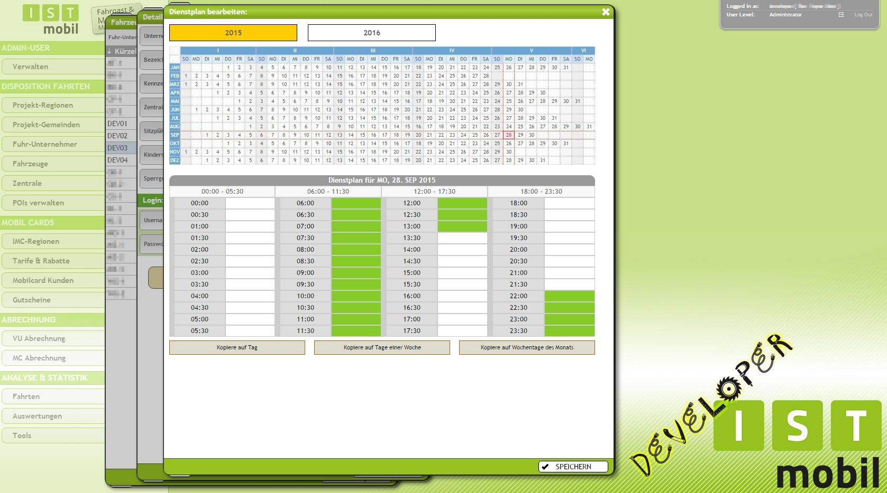
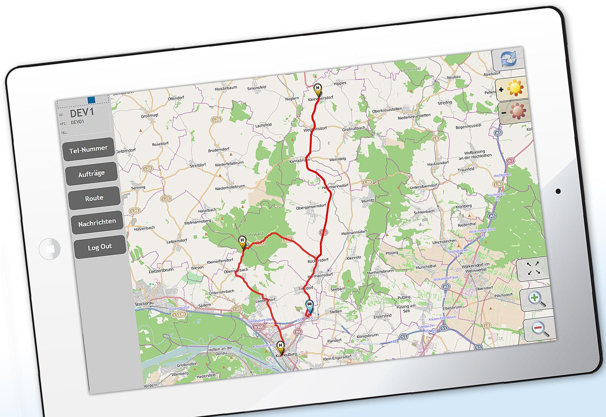
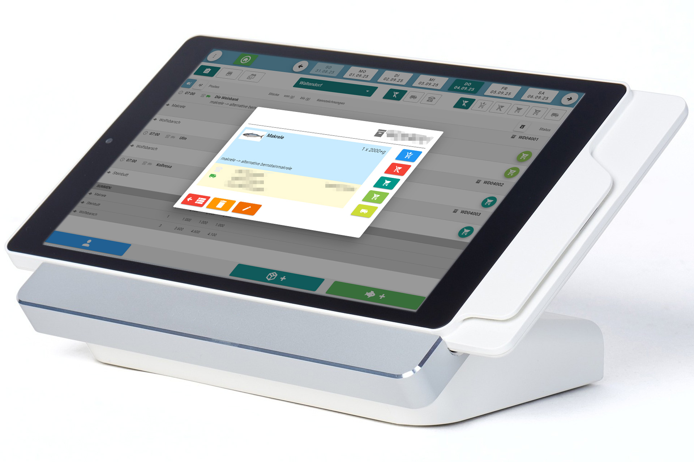
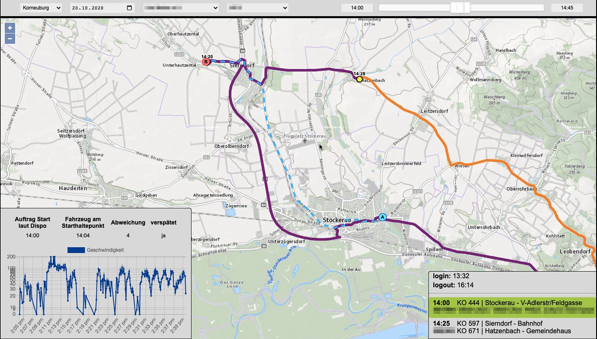
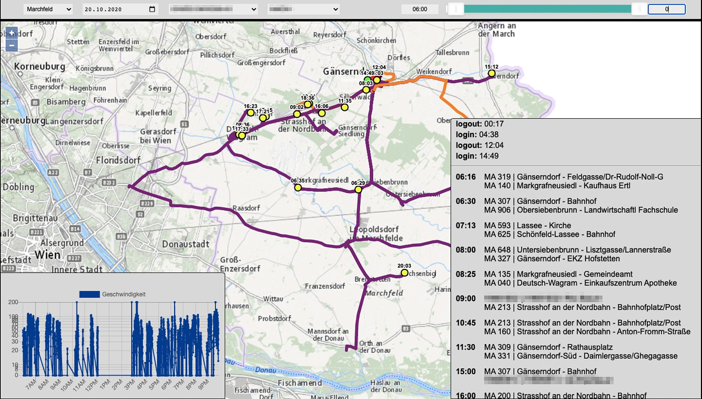
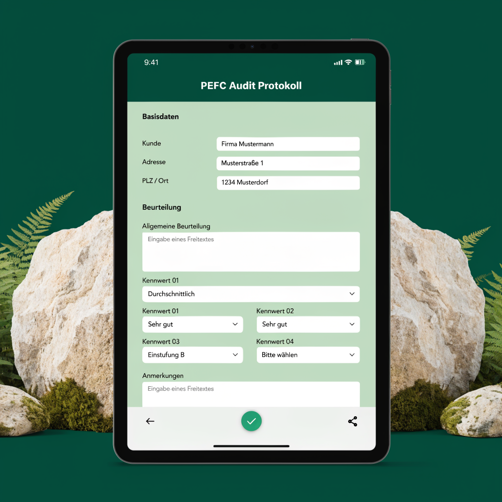
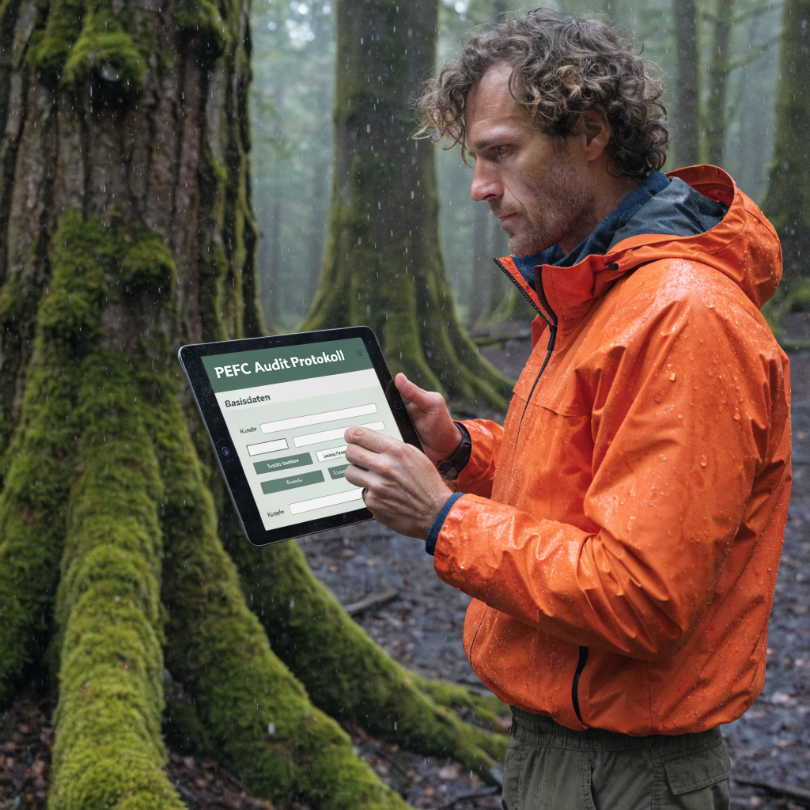
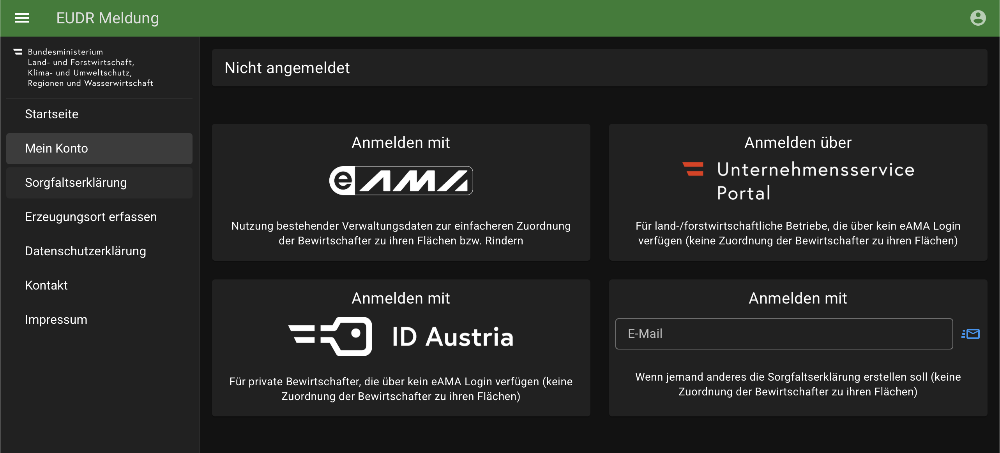
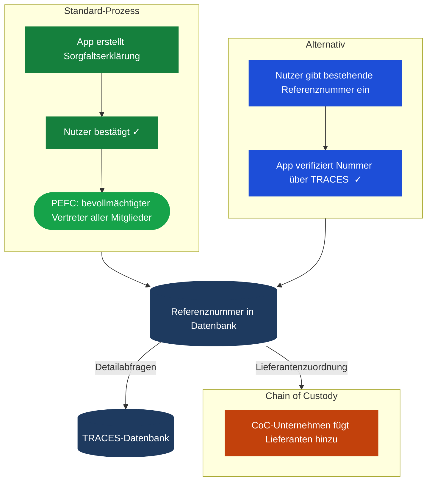

---
# try also 'default' to start simple
theme: default
# random image from a curated Unsplash collection by Anthony
# like them? see https://unsplash.com/collections/94734566/slidev
background: ./background.webp
# some information about your slides (markdown enabled)
title: PEFC-EUDR-RED Datenbankapplikation
info: |
  ## Slidev Starter Template
  Presentation slides for developers.

  Learn more at [Sli.dev](https://sli.dev)
# apply UnoCSS classes to the current slide
class: text-center
# https://sli.dev/features/drawing
drawings:
  persist: false
# slide transition: https://sli.dev/guide/animations.html#slide-transitions
transition: fade-out
# enable Comark Syntax: https://comark.dev/syntax/markdown
comark: true
# duration of the presentation
duration: 15min
---

# PEFC-EUDR-RED Datenbankapplikation

Webbasiertes System zur digitalen Verwaltung von PEFC-Teilnehmern, EUDR-Integration und RED-Selbsterklärung

<!--
The last comment block of each slide will be treated as slide notes. It will be visible and editable in Presenter Mode along with the slide. [Read more in the docs](https://sli.dev/guide/syntax.html#notes)
-->

---
layout: center
---

# w3geo GmbH

- Seit 2015 als w3geo
- Klassische Software- und Datenbankentwicklung + Geospatial Solutions (Geo-Informatik)
- Wichtigster Anspruch für jedes Projekt: Dem Benutzer eine möglichst perfekte Umsetzung zu bieten
  - UX = User-Experience ganz oben auf der Prioritätenliste.

<!-- AP -->

---
layout: default
---

# Umsetzungskonzept 1 / 4

- Rollenabhängige Benutzeroberfläche im Client, umgesetzt ausschließlich mit Open Source Frameworks (z.B. VUE)
  - Erfahrung aus div. Projekten, Beispiel ISTMobil:
    - *Große Datenbank mit tausenen Kunden, Verkehrsunternehmern, Disponenten, Administratoren usw.*
    - *Die Oberfläche wird rollenabhängig dargestellt*
    - *Für bestimmte Rollen responsive Versionen, z.B. Fahrzeug-Applikation*

  
  

---
layout: default
---

# Umsetzungskonzept 2 / 4

- Responsive Web-Formulare anstatt Excel-Sheets
 - Offline fähig (z.B. im Wald)
 - Erfahrung aus div. Projekten, z.B. GZA, eStrab, sofisch

  
  

---
layout: default
---

# Umsetzungskonzept 3 / 4

- Relationale Datenbank, geeignet für große Datenmengen und performative Suchen (z.B. PostgreSQL)
- Logging sämtlicher relevanter Ereignisse in Form eines sg. "Activity Trails"
  - bietet auch Verknüpfung zu DB-Entitäten / anderen Ereignissen
- Audit Tools für Auswertungen / Controlling
  - *Beispiel ISTMobil - Fahrzeug-Controlling*

  
  

---
layout: default
---

# Umsetzungskonzept 4 / 4

- Hosting in skalierbarer, performativer Server-Infrastruktur
  - ISO 27001 zertifiziertes Rechenzentrum 
  - Serverstandort EU 
  - Continuous Integration und Deployment (CI/CD) 

<!-- AP -->

---
layout: section
---

# Schlaglichter

<ph-flashlight class="text-7xl text-amber-300 mx-auto mt-2 block" />

<!-- AH -->

---
layout: center
---

# Web-Formulare

- Gut strukturierte Web-Formulare (Material Design)
- Voll Responsiv, Basiseigenschaften für Barrierefreiheit
- Zwischenspeicherung des aktuellen Standes
- Prüfung auf Vollständigkeit / Plausibilität bei Einreichung (Vorteil zu externen Dateien)
- **Offline Fähigkeit**
- Fallback: "Analoge" Formulare als Upload

  
  

---
layout: center
---

# Identity Provider, Authentifizierung

- Bereits Erfahrungen mit USP, eAMA Partner-Login, ID Austria
- Kenntnis der zugehörigen Antragsformalitäten
- Berücksichtigung der unterschiedlichen Charakteristika

---
layout: center
---

# Verknüpfen von Accounts und Duplikatvermeidung
- Eindeutige Attribute (LFBIS-Nummer) erleichtern Account-Verknüpfung
- Mitarbeiterdelegierung zum gemeinsamen Zugriff auf den gleichen Account (USP)
- Gemeinsame Eigenschaften (LFBIS-Nummer, Adresse) ermöglichen **Duplikatvermeidung** in der Datenbank

  
UNTERNEHMENSBEZOGEN

  
PERSONENBEZOGEN

  

    
eAMA Partner-Login

  

  

    
Unternehmensserviceportal

    
Mitarbeiterdelegierung

  

  

    
ID Austria

  

  
Land- und forstwirtschaftliche Betriebe mit LFBIS Nummer

  
Andere Betriebe (CoC)

  
Natürliche Personen

  

    Adressen aus dem amtlichen Adressregister
  

<!-- AH -->

---
layout: two-cols
---

# EUDR – EU Entwaldungsverordnung

::left::

- Bereits Erfahrung mit EUDR durch Entwicklung des **BMLUK EUDR-Meldung**-Tools
- Kenntnis der Prozesse rund um EUDR-Sorgfaltserklärungen und Referenznummern
- Technisches Know-how zur Anbindung an die **TRACES**-Datenbank

::right::

<!-- AH -->

---
layout: center
---

optional:

# Altdaten-Übernahme
- Erfordert Export/Kopie der Bestandsdatenbank
- Nur zu empfehlen für bereits strukturierte Daten
- Erspart Nutzerfrust bei Launch der neuen Applikation

  

    
1

    
Alt-App Login

  

  

  

    
2

    
Daten sichten

  

  

  

    
3

    
Verifizieren &amp; Anpassen

  

  

  

    
✓

    
Daten übernommen

  

<!-- AH -->

---
layout: center
---

# Räumliche Information

- Räumliche Daten sind "einfach da":
  - **Adressen** von Unternehmen und Benutzern (amtliches Adressregister)
  - **Bezirke**, in denen ein Forstbetrieb Waldflächen bewirtschaftet
- Mögliche Ausbaustufe: Erfassung von Waldflächen mit höherer Genauigkeit (Grundstück)
- **Potenzial der räumlichen Daten:**
  - Duplikatvermeidung bei Besitzerwechsel — gleiche Adresse signalisiert möglichen Zusammenhang
  - Karte der zertifizierten Mitglieder nach Bezirk / Dichte-Auswertung
  - Regionale Filterung &amp; Auswertungen für Controlling und Reporting

<!-- AH -->

---
layout: center
---

# Danke für die Aufmerksamkeit

<ph-handshake-thin class="text-7xl text-amber-400 mx-auto mt-4 block" />

<PoweredBySlidev class="abs-br m-8" />